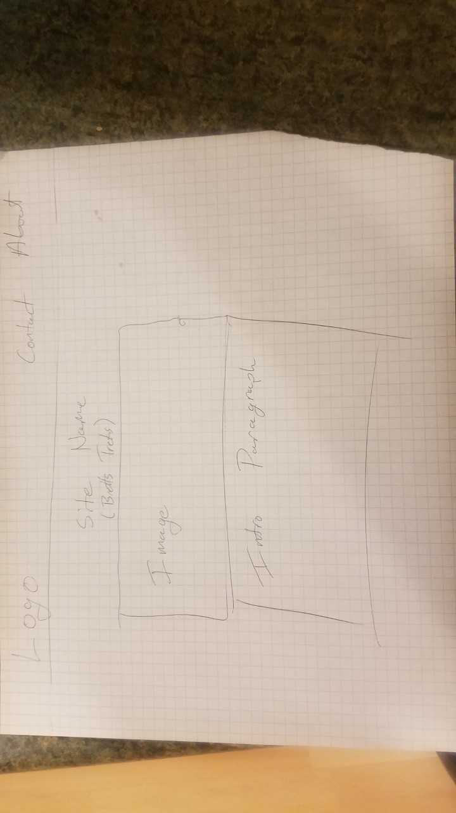

Margin is the space between elements, padding is the space between the content of an element and the element itself, and a border is the perimeter of an element.

For this assignment I started out reading the directions, then watching the walk through, then panicking and rushing to finish my website.
