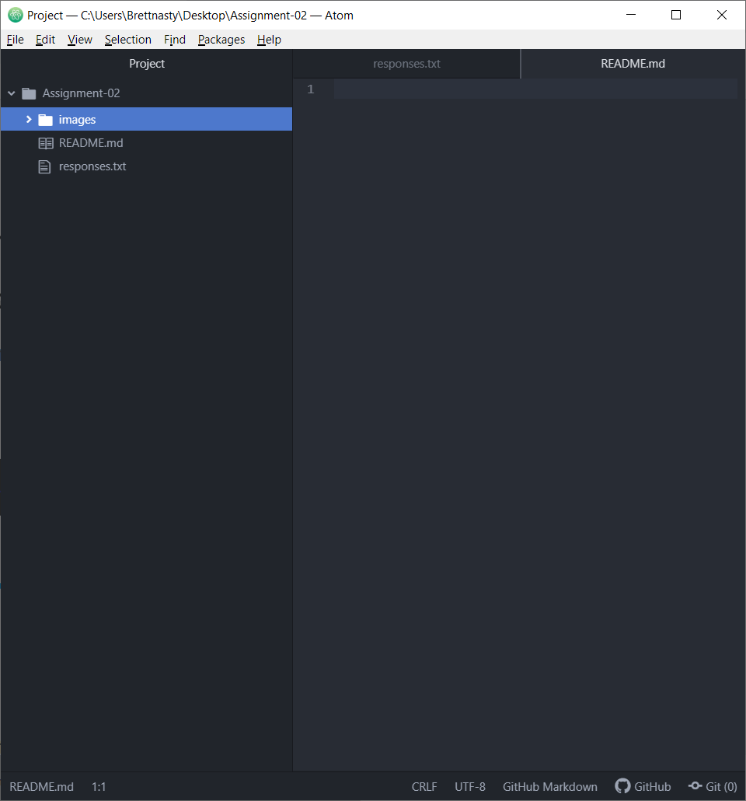

# Assignment-02
## Brett aniello

I chose to take this class because I plan to own my own business someday and would like to be able to build my own website.

A list of things I have learned and hope to learn:

1. I have learned how the internet works.
2. I have learned  how data travels through the internet/
3. I hope to learn how to put all the pieces together to design my own website for my business.

[Ebay Store](https://www.ebay.com/)

[Responses](./responses.txt)

