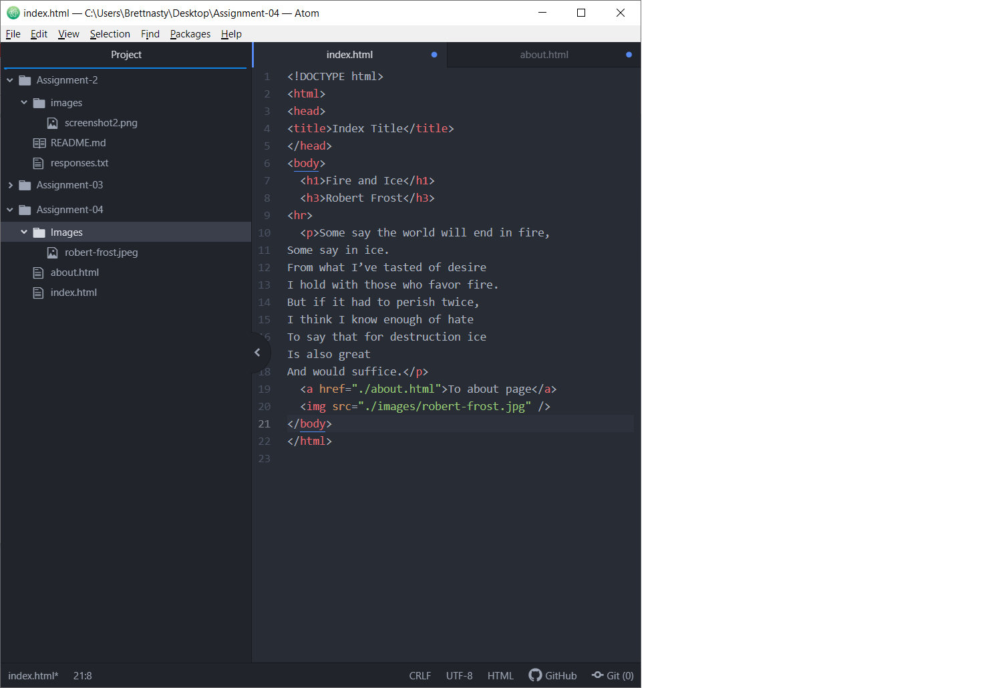

I viewed yahoo.com's homepage from 1996. It was just a bunch of links to other pages with no images other than yahoos logo. Now yahoos homepage is extremely complex with many different features.
Once I learned how to navigate the GIT module I found it extremely easy to use and preferred using that so i could see the issues within my webpage quickly.

